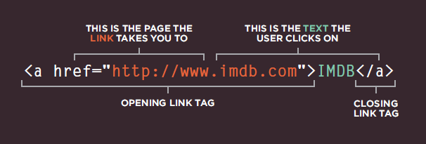
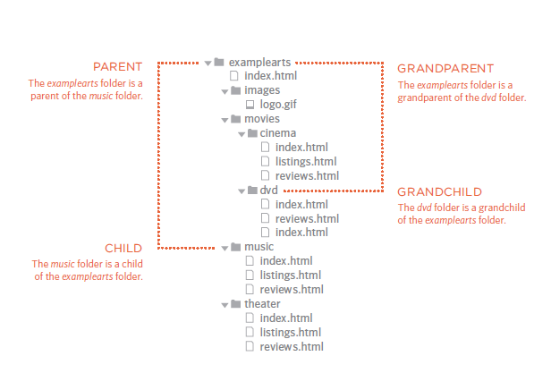

# Links 




# Linking to Other Sites


* < a >

Links are created using the   a> element which has an attribute called href. The value of the href attribute is the page that you want people to go to when they click on the link.

```
<p>Movie Reviews:
<ul>
<li><a href="http://www.empireonline.com">
Empire</a></li>
<li><a href="http://www.metacritic.com">
Metacritic</a></li>
<li><a href="http://www.rottentomatoes.com">
Rotten Tomatoes</a></li>
<li><a href="http://www.variety.com">
Variety</a></li>
</ul>
</p>
```
# Linking to Other Pages on the Sa me Site
```
<p>
<ul>
<li><a href="index.html">Home</a></li>
<li><a href="about-us.html">About</a></li>
<li><a href="movies.html">Movies</a></li>
<li><a href="contact.html">Contact</a></li>
</ul>
</p>
```
# Directory Structure




# Relative URLs

Relative URLs can be used when linking to pages within your own website. They provide a shorthand way of telling the browser where to find your files.


---

## Email Links
```
<a href="mailto:jon@example.org">Email Jon</a>
```
**mailto:**

To create a link that starts up the user's email program and addresses an email to a specified email address

---

## Opening Links in a New Window

**target**

```
<a href="http://www.imdb.com" target="_blank">
Internet Movie Database</a> (opens in new window)
```

---

# Layout


To indicate where a box should be positioned, you may also need to use box offset properties to tell the browser how far from the top or bottom and left or right it should be placed. (You will meet these when we introduce the positioning schemes on the following pages.


---


## position:static
normal flow, each block-level element sits on top of the next one.
```
body {
width: 750px;
font-family: Arial, Verdana, sans-serif;
color: #665544;}
h1 {
background-color: #efefef;
padding: 10px;}
p {
width: 450px;}
```

## position:relative
Relative positioning moves an element in relation to where it would have been in normal flow.
```
p.example {
position: relative;
top: 10px;
left: 100px;}
```
## position:absolute
When the position property is given a value of absolute, the box is taken out of normal flow and no longer affects the position of other elements on the page.
``
h1 {
position: absolute;
top: 0px;
left: 500px;
width: 250px;}
p {
width: 450px;} 
``

## position:fixed

Fixed positioning is a type of absolute positioning that requires the position property to have a value of fixed.

```
h1 {
position: fixed;
top: 0px;
left: 50px;
padding: 10px;
margin: 0px;
width: 100%;
background-color: #efefef;}
p.example {
margin-top: 100px;}
```

## z-index

When you use relative, fixed, or absolute positioning, boxes can overlap.

```
h1 {
position: fixed;
top: 0px;
left: 0px;
margin: 0px;
padding: 10px;
width: 100%;
background-color: #efefef;
z-index: 10;}
p {
position: relative;
top: 70px;
left: 70px;}
```