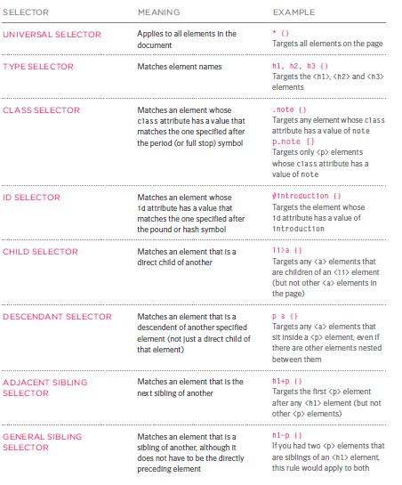
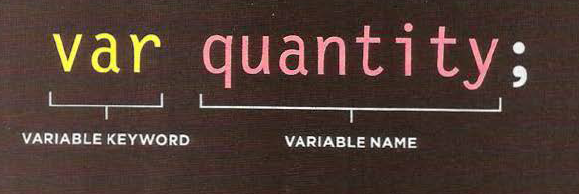
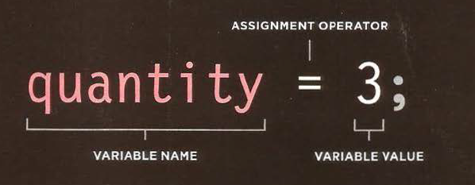
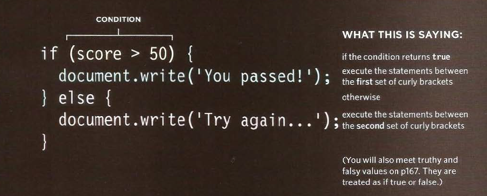
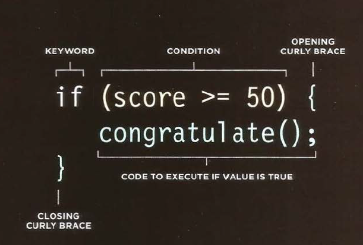
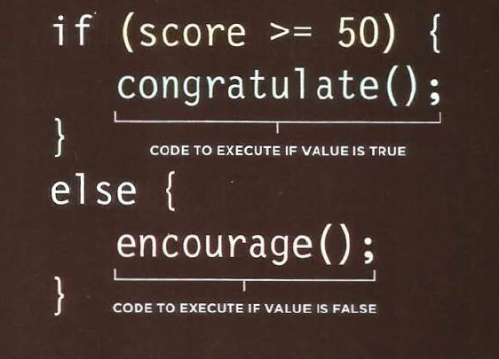

# Text 

## Headings :

`<h1>|<h2>|<h3>|<h3>|<h5>|<h6>` 

# This is h1 level 
## This is h2 level 
### This is h3 level 
#### This is h4 level 
##### This is h5 level 
###### This is h6 level 

---

## Paragraphs :
## < p>

```
<p>
To create a paragraph, surround
the words that make up the
paragraph with an opening <p>
tag and closing </p> tag.
By default, a browser will show
each paragraph on a new line
with some space between it and
any subsequent paragraphs.
Paragraph s
p>A paragraph consists of one or more sentences
that form a self-contained unit of discourse. The
start of a paragraph is indicated by a new
line.</p>
<p>Text is easier to understand when it is split up
into units of text. For example, a book may have
chapters. Chapters can have subheadings. Under
each heading there will be one or more
paragraphs.</p>
```

---

## Bold & It alic
## < b> & < i>

```
<p>This is how we <b>make</b> a word appear <i>italic</i>.
</p>
<p>It's a potato <i>Solanum teberosum</i>.</p>
<p>Captain Cook sailed to Australia on the
<i>Endeavour</i>.</p>
```

---

## Superscript & Subscript
## < sup> & < sub>


---
## White Space

When the browser comes across two or more spaces next to each other, it only displays one space. Similarly if it comes across a line break, it treats that as a single space too. This is known as white **space collapsing**.

---

## Line Breaks & Horizontal Rules


< br/>  

we use **br** to make new line 

< hr/>
we use **hr** to add a horizontal rule between

---

## Visual Editors & Their Code views
Content management systems and HTML editors such as Dreamweaver usually have two views of the page you are creating: a visual editor and a code view.

---

## Semantic Markup
There are some text elements that are not intended to affect the structure of your web pages, but they do add extra information to the pages — they are known as semantic markup.

---

## Strong & Emphasis

## < strong> :
to make any string between this tag Bold text  style.

## < em>
to make any string between this tag italic text style.

---

## Quotations

## < blockquote>


used for longer quotes that take up an entire paragraph. Note how the < p> element is still used inside the < blockquote> element.

## < q>

used for shorter quotes that sit within a paragraph.

---
## Abbreviations & Acronyms
## < abbr>
used A title attribute on the opening tag is used to specify the full term.

---
## Citations & Definitions

## < cite>
used to indicate where the citation is from.


## < dfn>
used to indicate the defining instance of a new term.

---
## Auth or Details

< address>
use to contain contact details for the author of the page.

---

## Changes to Content
## < ins>
used to show content that has been inserted into a document
## < del>

show text that has been deleted from it.

## < s>
indicates something that is no longer accurate or relevant (but that should not be deleted).

---
## CSS Associates Style rules with HTML elements


### CSS Properties Affect How Elements Are Displayed.

---

# Using External CSS

add tag < link> like this :

`<link href="css/styles.css" type="text/css" rel="stylesheet" />`

`href` This specifies the path to the
CSS file (which is often placed in
a folder called css or styles). 

`type` This attribute specifies the type of document being linked to. The value should be text/css.

`rel` This specifies the relationship between the HTML page and the file it is linked to. The value should be stylesheet when linking to a CSS file.

---

## Using Internal CSS
## < style>

You can add a CSS code by in the head tag add a style tag and write your code .

---
## CSS Selectors




---
## Inheritance
You can compare this with the background-color or border properties; they are not inherited by child elements. If these were inherited by all child elements then the page could look quite messy.

```
body {
font-family: Arial, Verdana, sans-serif;
color: #665544;
padding: 10px;}
.page {
border: 1px solid #665544;
background-color: #efefef;
padding: inherit;}
```

---


# JavaScript 

## STATEMENTS

A script is a series of instructions that a computer can follow one-by-one. Each individual instruction or step is known as a statement. Statements should end with a semicolon.

## COMMENTS

You should write comments to explain what your code does. They help make your code easier to read and understand. This can help you and others who read your code.

```
/* Th i s script displays a greeting to the user based upon the current time.
It is an example from JavaScript & jQuery book */
```

## WHAT IS A VARIABLE?

A script will have to temporarily store the bits of information it needs to do its job. It can store this data in variables.






## DATA TYPE:

* NUMERIC DATA TYPE `1 ,55 , 2.5 , 66.445`
* STRING DATA TYPE `Hi , abcd..`
* BOOLEAN DATA TYPE `true , false`


---


## RULES FOR NAMING VARIABLES :

1. The name must begin with a letter, dollar sign ($),or an underscore (_). It must not start with a number.
2. The name can contain letters, numbers, dollar sign ($), or an  underscore (_). Note that you must not use a dash(-) or a period (.) in a variable name.
3. You cannot use keywords or reserved words. Keywords are special words that tell the interpreter to do something. For example, var is a keyword used to declare a variable. Reserved words are ones that may be used in a future version of JavaScript.
4. All variables are case sensitive, so score and Score would be different variable names, but it is bad practice to create two variables that have the same name using different cases.
5. Use a name that describes the kind of information that the variable stores. For example, fi rstName might be used to store a person's first name,l astNarne for their last name, and age for their age.
6. If your variable name is made up of more than one word, use a capital letter for the first letter of every word after the first word. For example, f i rstName rather than fi rstnarne (this is referred to as camel case). You can also use an underscore between each word (you cannot use a dash).


# ARRAYS

An array is a special type of variable. It doesn't just store one value; it stores a list of values.

```
var colors;
colors = ['white', 'black', ' custom '];
var el=document.getElementByld('col ors');
el.textContent = col ors[O];
```

---

# CONDITION



## COMPARISON OPERATORS :

|OPERATOR| DESCRIPTION |
|---|---|
|(==) equal to|compares two values to see if are the same|
|(!=) not equal|compares two values to see if are not the same|
|(===) strict equal to|compares two values to check that both the data type and value the same |
|(!==) strict not equal to|compares two values to check that both the data type and value are not the same |
|(>) greater than|check if the number in the left is greater than the number on the right|
|(<) less than|check if the number in the left is less than the number on the right|
|(>=) greater than or equal|check if the number in the left is greater than or equal the number on the right|
|(<=) less than or equal|check if the number in the left is less than or equal the number on the right|

```
var scorel = 90; // Round 1 score
var score2 = 95; // Round 2 score
var highScorel 75; // Round 1 high score
var highScore2 = 95; // Round 2 high score

// Check if scores are higher than current high scores
var comparison= (score!+ score2) > (highScorel + highScore2);
II Write the message into the page
var el = document.getElementByid( 'answer');
el .textContent ='New high score:'+ comparison;
```


---


## LOGICAL OPEOPERATORS 

|OPERATOR|DESCRIPTION|
|---|---|
|(&&) logical and|to test more than one condition|
|(\|\|) logical or  |test at least one condition|
|(!) logical not|takes a single boolean value and inverts it |


```
var scorel = 8;// Round 1 score
var score2 = 8;// Round 2 score
var passl 6;// Round 1 pass mark
var pass2 = 6;// Round 2 pass mark


Next, the message is stored
in a variable called msg. At the
end of the message, the logical
NOT will invert the result of the
Boolean variable so it is false.
It is then written into the page.
II Check wh ether user passed one of the two rounds. store result in vari able
var minPass = ((scorel >= passl) I I (score2 >= pass2));
II Create message
var msg = 'Resit required: ' + !(minPass);
II Write the message into the page
var el = document.getElementByld('answer');
el .textContent = msg;
```

---

# If statements 

evaluats or checks a condition . if the cinditin evaluates to true , any statments in the subsequent code blick are ececuted.


