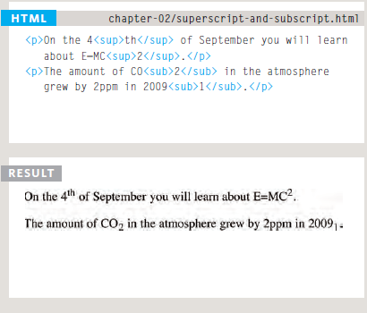
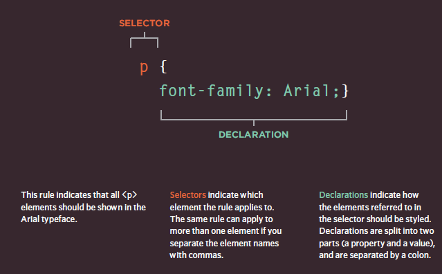

# Text 

## Headings :

`<h1>|<h2>|<h3>|<h3>|<h5>|<h6>` 

# This is h1 level 
## This is h2 level 
### This is h3 level 
#### This is h4 level 
##### This is h5 level 
###### This is h6 level 

---

## Paragraphs :
## < p>

```
<p>
To create a paragraph, surround
the words that make up the
paragraph with an opening <p>
tag and closing </p> tag.
By default, a browser will show
each paragraph on a new line
with some space between it and
any subsequent paragraphs.
Paragraph s
p>A paragraph consists of one or more sentences
that form a self-contained unit of discourse. The
start of a paragraph is indicated by a new
line.</p>
<p>Text is easier to understand when it is split up
into units of text. For example, a book may have
chapters. Chapters can have subheadings. Under
each heading there will be one or more
paragraphs.</p>
```

---

## Bold & It alic
## < b> & < i>

```
<p>This is how we <b>make</b> a word appear <i>italic</i>.
</p>
<p>It's a potato <i>Solanum teberosum</i>.</p>
<p>Captain Cook sailed to Australia on the
<i>Endeavour</i>.</p>
```

---

## Superscript & Subscript
## < sup> & < sub>



---
## White Space

When the browser comes across two or more spaces next to each other, it only displays one space. Similarly if it comes across a line break, it treats that as a single space too. This is known as white **space collapsing**.

---

## Line Breaks & Horizontal Rules


< br/>  

we use **br** to make new line 

< hr/>
we use **hr** to add a horizontal rule between

---

## Visual Editors & Their Code views
Content management systems and HTML editors such as Dreamweaver usually have two views of the page you are creating: a visual editor and a code view.

---

## Semantic Markup
There are some text elements that are not intended to affect the structure of your web pages, but they do add extra information to the pages — they are known as semantic markup.

---

## Strong & Emphasis

## < strong> :
to make any string between this tag Bold text  style.

## < em>
to make any string between this tag italic text style.

---

## Quotations

## < blockquote>


used for longer quotes that take up an entire paragraph. Note how the < p> element is still used inside the < blockquote> element.

## < q>

used for shorter quotes that sit within a paragraph.

---
## Abbreviations & Acronyms
## < abbr>
used A title attribute on the opening tag is used to specify the full term.

---
## Citations & Definitions

## < cite>
used to indicate where the citation is from.


## < dfn>
used to indicate the defining instance of a new term.

---
## Auth or Details

< address>
use to contain contact details for the author of the page.

---

## Changes to Content
## < ins>
used to show content that has been inserted into a document
## < del>

show text that has been deleted from it.

## < s>
indicates something that is no longer accurate or relevant (but that should not be deleted).

---
## CSS Associates Style rules with HTML elements
