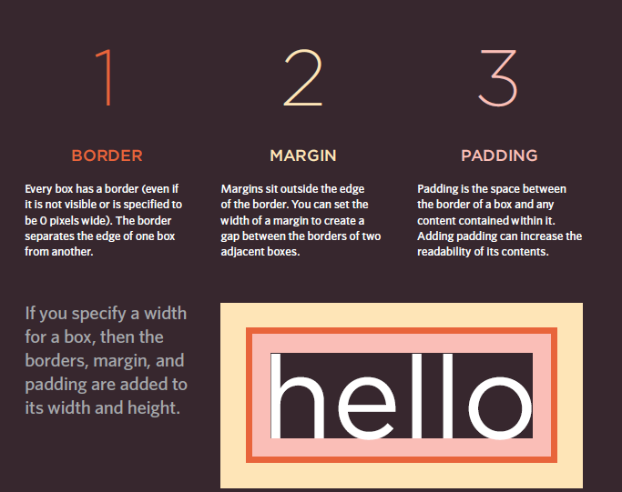
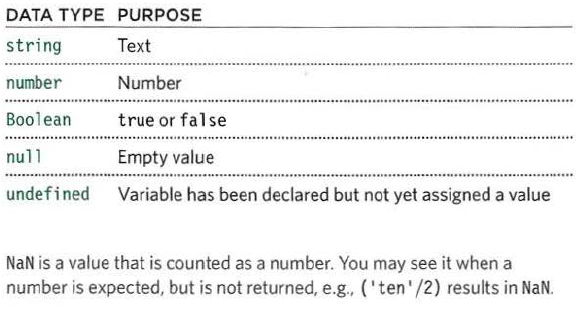
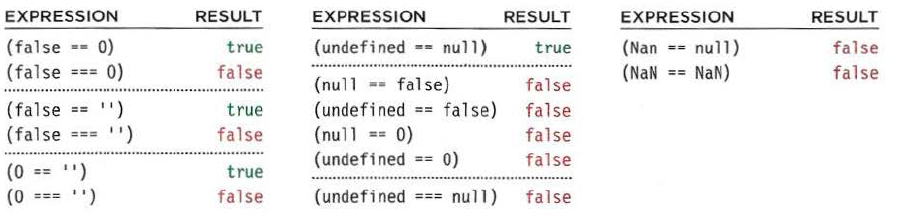

# LISTS 

1. **Ordered List**
  its a numbered list , like (1 2 3 ) or (I,II,III,IV)
  
  ```
<ol>
<li>Chop potatoes into quarters</li>
<li>Simmer in salted water for 15-20
minutes until tender</li>
<li>Heat milk, butter and nutmeg</li>
<li>Drain potatoes and mash</li>
<li>Mix in the milk mixture</li>
</ol>
  ```

2. **Unordred List**
  are lists that begin with a bullet point.

```
<ul>
<li>1kg King Edward potatoes</li>
<li>100ml milk</li>
<li>50g salted butter</li>
<li>Freshly grated nutmeg</li>
<li>Salt and pepper to taste</li>
</ul>
```

3. **Definition lists**
are made up of a set of terms along with the definitions for each of those terms.

```
<dl>
<dt>Sashimi</dt>
<dd>Sliced raw fish that is served with
condiments such as shredded daikon radish or
ginger root, wasabi and soy sauce</dd>
<dt>Scale</dt>
<dd>A device used to accurately measure the
weight of ingredients</dd>
<dd>A technique by which the scales are removed
from the skin of a fish</dd>
<dt>Scamorze</dt>
<dt>Scamorzo</dt>
<dd>An Italian cheese usually made from whole
cow's milk (although it was traditionally made
from buffalo milk)</dd>
</dl>
```
---

## NESTED LISTS
here you can use multible lists togthers
```
<ul>
<li>Mousses</li>
<li>Pastries
<ul>
<li>Croissant</li>
<li>Mille-feuille</li>
<li>Palmier</li>
<li>Profiterole</li>
</ul>
</li>
<li>Tarts</li>
</ul>

```

---

## Boxes
## Box Dimensions

* **width & height** 
uses for sized or resized the content you mintioned 

```
div.box {
height: 300px;
width: 300px;
background-color: #bbbbaa;}
p {
height: 75%;
width: 75%;
background-color: #0088dd;}
```

## Limiting Width

* **min-width, max-width**
uses to add limiting width you selected , who can not getovered .

```
td.description {
min-width: 450px;
max-width: 650px;
text-align: left;
padding: 5px;
margin: 0px;}
```

## Limiting Height
* **min-height, max-height**
uses to add limiting height you selected , who can not getovered .

```
h2, p {
width: 400px;
font-size: 90%;
line-height: 1.2em;}
h2 {
color: #0088dd;
border-bottom: 1px solid #0088dd;}
p {
min-height: 10px;
max-height: 30px;}
```

---
## Overflowing Content
* **overflow**

The overflow property tells the browser what to do if the content contained within a box is larger than the box itself. It can have one of two values:

1. **hidden**
This property simply hides any extra content that does not fit in the box.
2. **scroll**
This property adds a scrollbar to the box so that users can scroll to see the missing content.

```
p.one {
overflow: hidden;}
p.two {
overflow: scroll;}
```

---
## Border, Margin & Padding


---

## Border Width
* **border-width**
The border-width property is used to control the width of a border. The value of this property can either be given in pixels or using one of the following values:

```
p.one {
border-width: 2px;}
p.two {
border-width: thick;}
p.three {
border-width: 1px 4px 12px 4px;}
```
---
## Border Style
* **border-style**

|style|style|style|style|
|---|---|---|---|
|solid|dashed|double|groove|
|ridge|inset|outset|hidden-none|


You can individually change the styles of different borders using:
`border-top-style`
`border-left-style`
`border-right-style`
`border-bottom-style`

---
## Border Color 
* **border-color**

to add a color to border :

```
p.one {
border-color: #0088dd;}
p.two {
border-color: #bbbbaa #111111 #ee3e80 #0088dd;}
```

---


## Shorthand

|attrbute|Shorthand|
|---|---|
|border|border: 3px dotted #0088dd;}|
|padding| padding: 3px 4px 3px 5px|
|margin|margin: 3px 4px 3px 5px|

---

## Change Inline/Block

1. **inline**
This causes a block-level element to act like an inline element.
2. **block**
This causes an inline element to act like a block-level element.
3. **inline-block**
This causes a block-level element to flow like an inline element, while retaining other features of a block-level element.
4. **none**
This hides an element from the page. In this case, the element acts as though it is not on the page at all (although a user could still see the content of the box if they used the view source option in their browser).


---

## Hiding Boxes
* **visibility**

* **hidden**
This hides the element.

* **visible**
This shows the element.

```
li {
display: inline;
margin-right: 10px;}
li.coming-soon {
visibility: hidden;}
```
---

## CSS 3: Border images:

* **border-image**
The border-image property applies an image to the border of any box. It takes a background image and slices it into nine pieces.

```
p.one {
-moz-border-image: url("images/dots.gif")
11 11 11 11 stretch;
-webkit-border-image: url("images/dots.gif")
11 11 11 11 stretch;
border-image: url("images/dots.gif")
11 11 11 11 stretch;}
p.two {
-moz-border-image: url("images/dots.gif")
11 11 11 11 round;
-webkit-border-image: url("images/dots.gif")
11 11 11 11 round;
border-image: url("images/dots.gif")
11 11 11 11 round;}
```

* **box-shadow**
The box-shadow property allows you to add a drop shadow around a box. It works just like the text-shadow property that you met on page 288. It must use at least the first of these two values as well as a color:

```
p.one {
-moz-box-shadow: -5px -5px #777777;
-webkit-box-shadow: -5px -5px #777777;
box-shadow: -5px -5px #777777;}
p.two {
-moz-box-shadow: 5px 5px 5px #777777;
-webkit-box-shadow: 5px 5px 5px #777777;
box-shadow: 5px 5px 5px #777777;}
p.three {
-moz-box-shadow: 5px 5px 5px 5px #777777;
-webkit-box-shadow: 5px 5px 5px 5px #777777;
box-shadow: 5px 5px 5px 5px #777777;}
p.four {
-moz-box-shadow: 0 0 10px #777777;
-webkit-box-shadow: 0 0 10px #777777;
box-shadow: 0 0 10px #777777;}
p.five {
-moz-box-shadow: inset 0 0 10px #777777;
-webkit-box-shadow: inset 0 0 10px #777777;
box-shadow: inset 0 0 10px #777777;}
```

* **border-radius**

create rounded corners on any box, using a property called border-radius. The value indicates the size of the radius in pixels.

```
p {
border: 5px solid #cccccc;
padding: 20px;
width: 275px;
text-align: center;
border-radius: 10px;
-moz-border-radius: 10px;
-webkit-border-radius: 10px;}
```

---

# ARRAYS
An array is a special type of variable. It doesn't just store one values it stores a list of values.

```
var colors

new Array('white ' ,
'black',
'custom ' );
var el = document.getElementByid( ' co lors ' );
el.innerHTML = colors.item(O);
```
#### VALUES IN ARRAYS
Values in an array are accessed as if they are in a numbered list. It is important to know that the numbering of this list starts at zero (not one).

```
var col ors;
colors= ['whi te ' ,
'black ' ,
' custom'];

var itemThr ee;
itemThree = col ors [ 2] ;

var numColors ;
numColors =col ors. length;
```

|index|Value|
|---|---|
|0|'white'|
|1|'black'|
|2|'custom'|

```
II Create the array
var colors = ['white',
'black' ,
'custom'];
c02/ js/ update-array.js
II Update the third item in the array
colors[2] = 'beige ' ;
II Get the element with an id of col ors
var el = document .getElementByid(' colors') ;
II Replace with third item from the array
el .textContent = colors[2];
```

---
# SWITCH STATEMENTS

A switch statement starts with a variable called the switch value.
Each case indicates a possible value for this variable and the code that should run if the variable matches that value.

```
switch (level) {
case 'O ne ':
title= 'Level 1 ' ;
break;
case 'Two':
tit 1 e = ' Level 2 ' ;
break;
case ' Three' :
title = 'Level 3' ;
break ;
default :
title= 'Test';
break;

```

```
var msg;
var level = 2;
II Message
11 Level

/I Determine message based on level
switch (level) {
case 1:
msg = 'Good luck on the first test ' ;
break;
case 2:
msg = 'Second of three - keep going!';
break;
case 3:
msg = ' Final round, almost there!';
break;
default :
msg = 'Good l uck!';
break;
var el = document.getEl ementByld('answer ' );
el .textContent = msg;
```
`OUTPUT : `

```
Second of three - keep going!
```




### TRUTHY & FALSY VALUES

`Falsy values` are treated as if they are fa 1 se. The table to the left shows a hi ghScore variable with a series of va lues, all of which are falsy.

`Truthy values` are treated as if they are true. Almost everything that is not in the falsy table can be treated as if it were true.

A `unary operator` returns a result with just one operand. Here you can see an if statement checking for the
presence of an element. If the element is found, the result is truthy, so the first set of code is run. If it is not found, the second set is run instead.

```
if (document .getElementByid('header')) {
II Found: do something
else {
// Not found: do something else
}
```



---

## SHORT CIRCUIT VALUES
Logical operators are processed left to right. They short-circuit (stop) as soon as they have a result - but they return the value that stopped the processing (not necessarily true or fa 1 se).

```
valueA = O;
valueB = 1;
valueC = 2;
if (valueA I I valueB II valueC) {
    // do somthing here
}
```

## LOOPS 


``` loops check a condition , if it returns true , a code block will run , and the condition will be checked again and if it still retuns true , it's repate until the condition returns false  ```


### 1) For loop :

  ``` for(var i=0; i<10; i++) { ``` 
  ``` document.write(i) } ```

  > `for` : keyword
  > `(var i=0; i<10; i++)`: condition (counter)
  > `{document.write(i)}` : for bblock code


  #### about condition (counter ) is contian :

  1. initialization `var i=0 ;`
  2. condition `i<10;`
  3. update `i++`


  > start loop when i=0;
  >> run the code and the i increment 
  >>> if the condition still TRUE , repate the code 


### 1) while loops :

```
var i = l ;
var msg = ' ' ;
II Set counter to 1
II Message
II Store 5 times tabl e in a variable
while (i < 10) {
msg += i + ' x 5 = ' + (i * 5) + '<br I>';
i++;
}
document .getEl ementByid( ' answer') . innerHTML = msg;
```

_This loop will continue to run for as long as the condition in the parentheses is true. That condition is a counter indicating that, as long as the variable i remains less than 10, the statements in the subsequent code block should run._
