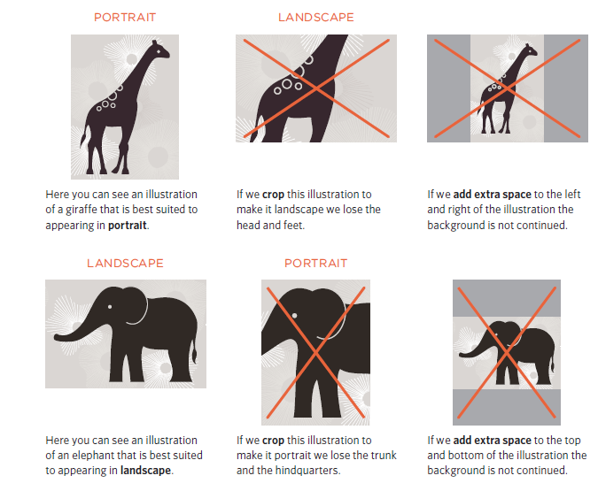
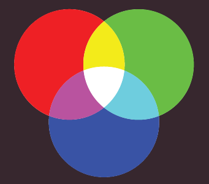
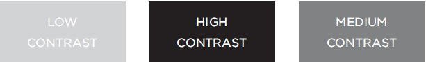
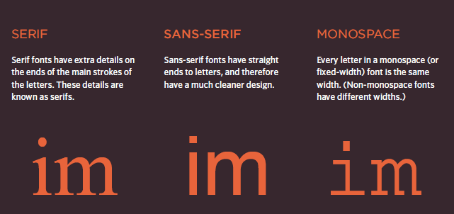
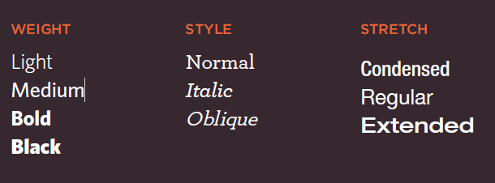
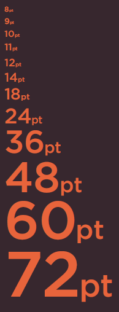
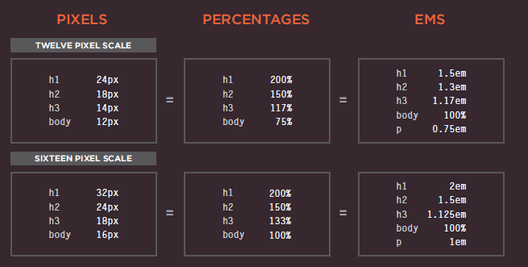
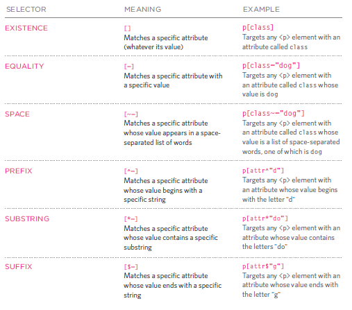

# Images

* Include an image in your web pages using HTML
* Pick which image format to use
* Show an image at the right size
* Optimize an image for use on the web to make pages load faster

You can use the images from local machine or from URL .

# Adding Images

``

`` : image tag.

`src=""`: This tells the browser where it can find the image file.

`alt=""` :This provides a text description of the image

`title=""`:to provide additional information about the image.

# Height & Width of Images

```

```

# Where to Place Images in Your Code

1. before a paragraph
1. inside the start of a paragraph
1. in the middle of a paragraph


# Three Rules for Creating Images

1. Save images in the right format
2. Save images at the right size
3. Use the correct resolution

---
# Tools to Edit & Save Images

There is some tools you can uses to edit an save images like : Adobe Photoshop.


---

# Images format :

* APNG
* AVIF 
* GIF
* JPEG
* PNG
* SVG
* WebP

# Cropping Images

When cropping images it is important not to lose valuable information. It is best to source images that are the correct shape if possible.



# Image Resolution

Images appearing on computer screens are made of tiny squares called pixels. A small segment of this photograph has been magnified to show how it is made up of pixels.

# Vector Images
Vector images differ from bitmap images and are resolution-independent. Vector images are commonly created in programs such as Adobe Illustrator.


# Animated GIFs

Animated GIFs show several frames of an image in sequence and therefore can be used to create simple animations.


# Transparency


# HTML 5: Figure and Figure Caption
< figure> element to contain images and their caption so that the two are associated.

The < figcaption> element has been added to HTML5 in order to allow web page authors to add a caption to an image.
```
<figure>

<br />
<figcaption>Sea otters hold hands when they
sleep so they don't drift away from each
other.</figcaption>
</figure>
```


# `Color` :


#### The color property allows you to specify the color of text inside an element. You can specify any color in CSS in one of three ways:

1. `rgb values` : These express colors in terms of how much red, green and blue are used to make it up. For example: rgb(100,100,90)
2. `hex codes` : These are six-digit codes that represent the amount of red, green and blue in a color, preceded by a pound or hash # sign. For example: #ee3e80
3. `color names`: There are 147 predefined color names that are recognized by browsers. For example: DarkCyan


---


### background-color 

```
body {
background-color: rgb(200,200,200);}
h1 {
background-color: DarkCyan;}
h2 {
background-color: #ee3e80;}
p {
background-color: white;}

```




` ``Every color on a computer screen is created by mixing amounts of red, green, and blue. To find the color you want, you can use color picker.`` `


## Hue , Saturation , Brightness:

1. `Hue` : Hue is near to the colloquial idea of color. Technically speaking however, a color can also have saturation and brightness as well as hue.

2. `Saturation` : Saturation refers to the amount of gray in a color. At maximum saturation, there would be no gray in the color. At minimum saturation, the color would be mostly gray.
3. `Brightness` :Brightness (or "value") refers to how much black is in a color. At maximum brightness, there would be no black in the color. At minimum brightness, the color would be very dark.

---
## Contrast

When picking foreground and background colors, it is important to ensure that there is enough contrast for the text to be legible.



---
## Opacity

CSS3 introduces the opacity property which allows you to specify the opacity of an element and any of its child elements. The value is a number between 0.0 and 1.0 (so a value of 0.5 is 50% opacity and 0.15 is 15% opacity).

```
p.one {
background-color: rgb(0,0,0);
opacity: 0.5;}
p.two {
background-color: rgb(0,0,0);
background-color: rgba(0,0,0,0.5);}

```


---
## HSL Colors

## `hsl, hsla`

`hue`
This is expressed as an angle (between 0 and 360 degrees).

`saturation`
This is expressed as a percentage. 

`lightness` 
This is expressed as a percentage with 0% being white, 50% being normal, and 100% being black. The hsla color property allows you to specify color properties using hue, saturation, and lightness as above, and adds a fourth value which represents transparency (just like the rgba property)  The a stands for:

`alpha`
This is expressed as a number between 0 and 1.0. For example, 0.5 represents50% transparency, and 0.75 represents 75% transparency.


--- 
# TEXT 

## Typeface Terminology




## font-family

property allows you to specify the typeface that should be used for  any text inside the element(s) to which a CSS rule applies.

```
<style type="text/css">
body {
font-family: Georgia, Times, serif;}
h1, h2 {
font-family: Arial, Verdana, sans-serif;}
.credits {
font-family: "Courier New", Courier,
monospace;}
</style>
```

## font-size
### font-size
The font-size property enables you to specify a size for the font. There are several ways to specify the size of a font.

```
body {
font-family: Arial, Verdana, sans-serif;
font-size: 12px;}
h1 {
font-size: 200%;}
h2 {
font-size: 1.3em;}
```

## Type Scales


## Units of Type Size



## @font-face

```
@font-face {
font-family: 'ChunkFiveRegular';
src: url('fonts/chunkfive.eot');}
h1, h2 {
font-family: ChunkFiveRegular, Georgia, serif;}
```

## Bold
- font-weight

The font-weight property allows you to create bold text. There are two values that this property commonly takes:

1. normal
2. bold

## Italic
- font-style
If you want to create italic text, you can use the font-style property. There are three values this property can take:

1. normal
2. italic
3. oblique


## UpperCase & LowerCase
- text-transform
The text-transform property is used to change the case of text giving it one of the following values:

1. uppercase
2. lowercase
3. capitalize

## Underline & Strike
- text-decoration

The text-decoration property allows you to specify the following values:

1. none
2. underline
3. overline
4. line-through
5. blink


## Leading
- line-height
is a term typographers use for the vertical space between lines of text. In a typeface, the part of a letter that drops beneath the baseline is called a descender, while the highest point of a letter is called the ascender.

## Letter & Word Spacing
- letter-spacing, word-spacing
Kerning is the term typographers use for the space between each letter. You can control the space between each letter with the letter-spacing property.

## Alignment
- text-align

The text-align property allows you to control the alignment of text. The property can take one of four values:

1. left
2. right
3. center
4. justify

## Vertical Alignment
- vertical-align

is a common source of confusion. It is not intended to allow you to vertically align text in the middle of block level elements such as < p> and < div>.

values it can take are:

1. baseline
1. sub
1. super
1. top
1. text-top
1. middle
1. bottom
1. text-bottom

## Indenting Text
- text-indent
 allows you to indent the first line of text within an element. The amount you want the line indented by can be specified in a number of ways but is usually given in pixels or ems.


 ## CSS3: Drop Shadow
- text-shadow
The text-shadow property has become commonly used despite lacking support in all browsers.

```
p.one {
background-color: #eeeeee;
color: #666666;
text-shadow: 1px 1px 0px #000000;}
p.two {
background-color: #dddddd;
color: #666666;
text-shadow: 1px 1px 3px #666666;}
p.three {
background-color: #cccccc;
color: #ffffff;
text-shadow: 2px 2px 7px #111111;}
p.four {
background-color: #bbbbbb;
color: #cccccc;
text-shadow: -1px -2px #666666;}
p.five {
background-color: #aaaaaa;
color: #ffffff;
text-shadow: -1px -1px #666666;}

```

## First Lett er or Line
- :first-letter, :first-line

 You can specify different values for the first letter or first line of text inside an element using :first-letter and :first-line.

```
p.intro:first-letter {
font-size: 200%;}
p.intro:first-line {
font-weight: bold;}
```

## Styling Links
- :link, :visited
Browsers tend to show links in blue with an underline by default, and they will change the color of links that have been visited to help users know which pages they have been to.


```
a:link {
color: deeppink;
text-decoration: none;}
a:visited {
color: black;}
a:hover {
color: deeppink;
text-decoration: underline;}
a:active {
color: darkcyan;}
```

## Responding to Users
:hover, :active, :focus

`:hover`

This is applied when a user hovers over an element with a pointing device such as a mouse. This has commonly been used to change the appearance of links and buttons when a user places their cursor over them.

`:active`
This is applied when an element is being activated by a user; for example, when a button is being pressed or a link being clicked. Sometimes this is used to make a button or link feel more like it is being pressed by changing the style or position of the element slightly.

`:focus`
This is applied when an element is being activated by a user; for example, when a button is being pressed or a link being clicked.
Sometimes this is used to make a button or link feel more like it is being pressed by changing the style or position of the element slightly.

## Attribute Selectors




-----


# BMP vs JPEG vs PNG vs GIF

