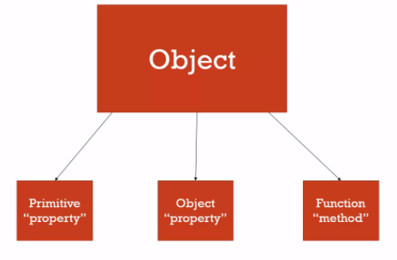

# Problem Domain, Objects, and the DOM


### Problem Domain

Understanding The Problem Domain Is The Hardest Part Of Programming

Why problem domains are hard??

because you can’t really see what you are trying to build very clearly.


# What can you do about it?

- Make the problem domain easier
- Get better at understanding the problem domain


By creating a familiar problem domain, I found that both the tasks of me teaching a new technology and the viewer learning that technology were much easier, because it is very difficult to learn more than one thing at once.

---


---


# Object Literals

```
Objects group together a set of variables and functions to create a modelof a something you would recognize from the real world. In an object,variables and functions take on new names.
```

*  IN AN OBJECT: VARIABLES BECOME KNOWN AS PROPERTIES
*  IN AN OBJECT: FUNCTIONS BECOME KNOWN AS METHODS




---

# DOM

The Document Object Model (DOM) specifies how browsers should create a model of an HTML page and how JavaScript can access and update the contents of a web page while it is in the browser window.

The DOM is neither part of HTML, not part of JavaScript; it is a separate set of rules. It is implemented by all major browser makers, and covers two primary areas:

1. MAKING A MODEL OF THE HTML PAGE
2. ACCESSING AND CHANGING THE HTML PAGE

## DOM TREE


## DOM tree have two sectio

* ATTRIBUTE NODES : The opening tags of HTML elements can carry attributes and these are represented by attribute nodes in the DOM tree.

* TEXT NODES : Once you have accessed an element node, you can then reach the text within that element. This is stored in its own text node.

---
## WORKING WITH THE DOM TREE

Accessing and updating the DOM tree involves two steps:

Locate the node that represents the element you want to work with.
Use its text content, child elements, and attributes.

`STEP 1`: ACCESS THE ELEMENTS

`STEP 2`: WORK WITH THOSE ELEMENTS

---
## ACCESSING ELEMENTS

DOM queries may return one element, or they may return a Nodelist, which is a collection of nodes.

### Accessing a DOM element By TagName:
1. getElementByTagName
1. getElementByTagName.html
1. getElementByClassName

