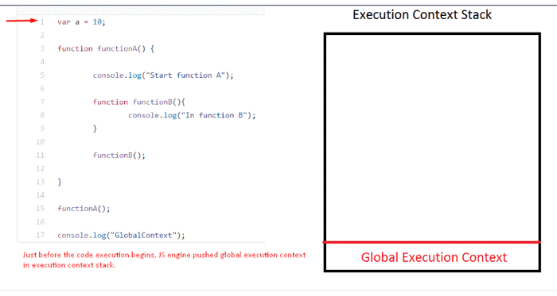
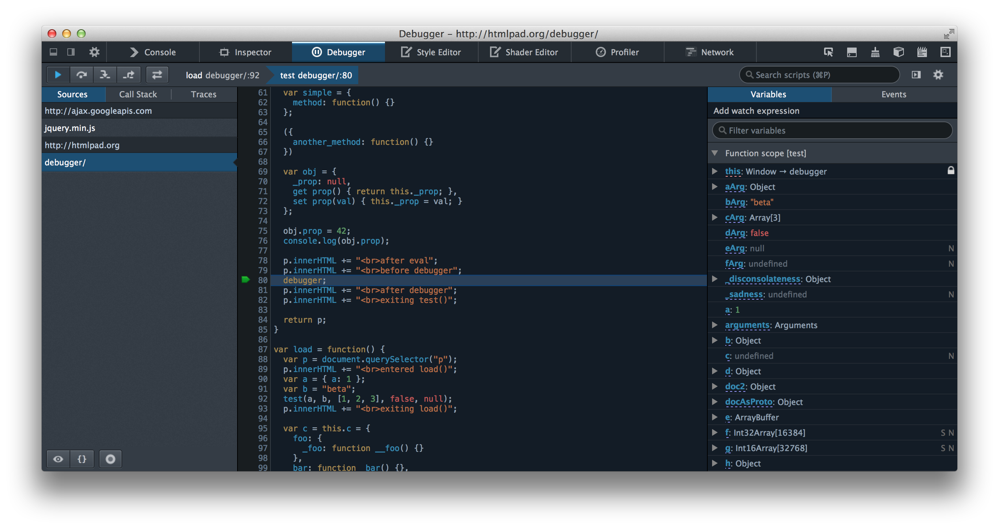

# Error Handling & Debugging

## Introduction
In an ideal world everyone would write perfect code and there would never be any need to debug. However in reality, virtually every project is going to require some degree of debugging. The more complex the project the more like this is to be true. Fortunately LiveCode includes a full plethora of debugging tools and techniques that make it quick and easy to track down errors. The live run-edit cycle allows you to see the effect of corrections as soon as you make them. And, unlike working in a lower-level language, when you make a mistake you will receive a human-friendly error message pointing you to where the error occurred, instead of the application unexpectedly quitting.

As well as the set of built-in error reporting and debugging tools, LiveCode also allows you complete flexibility over error handling, allowing you to provide a customized experience to the end user of your application.


---

## ORDER OF EXECUTION

To find the source of an error, it helps to know how scripts are processed. The order in which statements are executed can be complex; some tasks cannot complete until another statement or function has been run:


1. The greeting variable gets its value from the
greetUser() function.2. greetUser() creates the message by combining
the string 'He 11 o ' with the result of getName ().

3. getName () returns the name to greetUser() .
2. greetUser() now knows the name, and combines
it with the string. It then returns the message to the
statement that ca lled it in step 1.
1. The va lue of the greeting is stored in memory.
4. This greeting variable is written to an alert box.

## EXECUTION CONTEXTS

The JavaScript interpreter uses the concept of execution contexts. There is one global execution context; plus, each function creates a new new execution context. They correspond to variable scope.

Execution context (EC) is defined as the environment in which the JavaScript code is executed. By environment, I mean the value of this, variables, objects, and functions JavaScript code has access to at a particular time.
Execution context in JavaScript is of three types as:

## `Global execution context (GEC):` 

This is the default execution context in which JS code start its execution when the file first loads in the browser. All of the global code i.e. code which is not inside any function or object is executed inside the global execution context. GEC cannot be more than one because only one global environment is possible for JS code execution as the JS engine is single threaded.

## `Functional execution context (FEC):` 
Functional execution context is defined as the context created by the JS engine whenever it finds any function call. Each function has its own execution context. It can be more than one. Functional execution context has access to all the code of the global execution context though vice versa is not applicable. While executing the global execution context code, if JS engine finds a function call, it creates a new functional execution context for that function. In the browser context, if the code is executing in strict mode value of this is undefined else it is window object in the function execution context.

## `Eval:` 

Execution context inside eval function.


---

# `stack (ECS):` 

Execution context stack is a stack data structure, i.e. last in first out data structure, to store all the execution stacks created during the life cycle of the script. Global execution context is present by default in execution context stack and it is at the bottom of the stack. While executing the global execution context code, if JS engines find a function call, it creates a functional execution context for that function and pushes it on top of the execution context stack. JS engine executes the function whose execution context is at the top of the execution context stack. Once all the code of the function is executed, JS engines pop out that function’s execution context and start’s executing the function which is below it.
Let’s understand this with the help of an example:




---

# `EXECUTION CONTEXT & HOISTING`

## 1. PREPARE
•The new scope is created

• Variables, functions, and arguments are created

• The value of the this keyword is determined

## 2. EXECUTE

• Now it can assign values to variables

• Reference functions and run their code

• Execute statements

Understanding that these two phases happen helps with understanding a concept called hoisting.

 You
may have seen that you can:
• Call functions before they have been declared
(if they were created using function declarations
- not function expressions

- Assign a value to a va ria ble that has not yet been declared


```
Each execution context also creates its own vari ab 1 es object. This object contains details of all of the variables, functions, and parameters for that execution context.

```

---

# UNDERSTANDING SCOPE


Functions in JavaScript are said to have lexical scope. They are linked to the object they were defined within. So, for each execution context, the scope is the current execution context's variables object, plus the variables object for each parent execution context.


## UNDERSTANDING ERRORS

If a JavaScript statement generates an error, the it throws an exception. At that point, the interpreter stops and looks for exception-handling code.


---

# ERROR OBJECTS


## Syntax Error
`SYNTAX IS NOT CORRECT`

This is caused by incorrect use of the rules of the language. It is often the result of a simple typo.

>>>> MISMATCHING OR UNCLOSED QUOTES

document .write ("Howdyl );

`SyntaxError: Unexpected EOF`

>>>> MISSING CLOSING BRACKET

document .getElementByid('page' I

`SyntaxErr or : Expected token ' ) '`

>>>> MISSING COMMA IN ARRAY

Would be same for missing] at the end

var l ist = ['Item 1', 'Item 2 ' l 'rtem 3'];

`SyntaxError: Expected token ']'`

>>>> MALFORMED PROPERTY NAME

It has a space but is not surrounded by quote marks

user = { f i rstl name: "Ben", lastName: "Lee"};

`Synt axError: Expected an identifier but found 'name ' instead`


## ReferenceError

`VARIABLE DOES NOT EXIST`

This is caused by a variable that is not declared or is out of scope.

>>> VARIABLE IS UNDECLARED

var wi dth = 12 ;

var area = width * llt!ftNU! ;

`ReferenceError: Can ' t find vari able: height`

>>> NAMED FUNCTION IS UNDEFINED

document.write ( randomFunction() ) ;

`ReferenceError: Can't find variable : randomFunction`


## EvalError

`INCORRECT USE OF eval() FUNCTION`

The eval () function evaluates text through the interpreter and runs it as code (it is not discussed in this book). It is rare that you would see this type of error, as browsers often throw other errors when they are supposed to throw an Eva 1 Error.


## URIError

`INCORRECT USE OF URI FUNCTIONS`

If these characters are not escaped in URls, they will cause an error: / ? & I : ;CHARACTERS ARE NOT ESCAPED decodeURI('http: //bbc . com/ news . phplla=l') ; URlError: URI error


---

## HOW TO DEAL WITH ERRORS

### 1.  DEBUG THE SCRIPT TO FIX ERRORS  
If you come across an error while writing a script  
(or when someone reports a bug), you will need to  
debug the code, track down the source of the error,  
and fix it.

### 2. HANDLE ERRORS GRACEFULLY
 
You can handle errors gracefully using try, catch, 
throw, and f i na 1 ly statement s. 
Sometimes, an error may occur in the script for a 
reason beyond your control. For example, you might 
request data from a third party, and their server may not respond. In such cases, it is particularly important to write error-handling code.


## A DEBUGGING WORKFLOW

#### WHERE IS THE PROBLEM?

1. Look at the error message
2. Check how far the script is running.
3. Use breakpoints where things are going wrong.

#### WHAT EXACTLY IS THE PROBLEM?
1. When you have set breakpoints, you can see if the variables around them have the values you would expect them to. If not, look earlier in the script.
2. Break down I break out parts of the code to test smaller pieces of the functionality.

3. Check the number of parameters for a function, or the number of items in an array.


----

## BROWSER DEV TOOLS & JAVASCRIPT CONSOLE

The JavaScript console will tell you when there is a problem with a script, where to look for the problem, and what kind of issue it seems to be.


---

## HOW TO LOOK AT ERRORS IN CHROME


---

## MORE CONSOLE METHODS

#### GROUPING MESSAGES

#### WRITING TABULAR DATA

#### WRITING ON A CONDITION


----


# BREAKPOINTS

CHROME
1. Select the Sources option.
2. Select the script you are working with from the left-hand pane. The code will appear to the right.
3. Find the line number you want to stop on and click on it.
4. When you run the script, it
will stop on this line. You can now hover over any variable to see its value at that time in the script's execution.

## CONDITIONAL BREAKPOINTS

You can indicate that a breakpoint should be triggered only if a condition that you specify is met. The condition can use existing variables.

CHROME
1. Right-click on a line number.
2. Select Add Conditional Breakpoint...
3. Enter a condition into the popup box.
4. When you run the script, it
will only stop on this line if the condition is true (e.g., if area is less than 20).


---

## DEBUGGER KEYWORD

The debugger statement invokes any available debugging functionality, such as setting a breakpoint. If no debugging functionality is available, this statement has no effect.

Syntax
>> debugger;

```
function potentiallyBuggyCode() {
    debugger;
    // do potentially buggy stuff to examine, step through, etc.
}
```




---

# HANDLING EXCEPTIONS

## The try-catch
As with many programming languages, the primary method of dealing with exceptions in JavaScript is the try-catch. In a nutshell, the try-catch is a code block that can be used to deal with thrown exceptions without interrupting program execution. In other words, you can "try" to execute a block of code, and "catch" any exceptions that are thrown.

```
try {
  // ...
} catch (e) {
  // ...
}
```


---

## THROWING ERRORS

If you know something might cause a problem for your script, you can generate your own errors before the interpreter creates them 

To create your own error, you use the following line:

#### `throw new Error( 'message 1');`


## THROW ERROR FOR NaN


---

# DEBUGGING TIPS

- ANOTHER BROWSER
- SEARCH
- VALIDATION TOOLS
- ADD NUMBERS
- CODE PLAYGROUNDS
- STRIP IT BACK
- EXPLAINING THE CODE

-----

