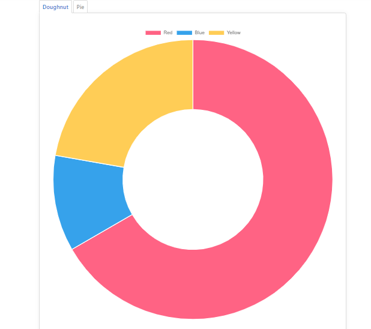
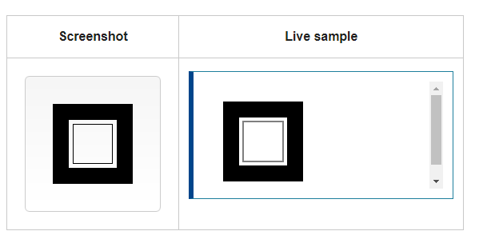

# Charts 

 are far better for displaying data visually than tables and have the added benefit that no one is ever going to press-gang them into use as a layout tool. They’re easier to look at and convey data quickly, but they’re not always easy to create.

 ---

 # Chart.js

### Installation
You can get the latest version of Chart.js from [npm](https://www.npmjs.com/package/chart.js) , the [GitHub releases](https://github.com/chartjs/Chart.js/releases/latest) , or use a [Chart.js CDN](https://www.jsdelivr.com/package/npm/chart.js) .Detailed installation instructions can be found on the [installation](https://www.chartjs.org/docs/latest/getting-started/installation.html) page.


### Creating a Chart

1. add canvas tag in html body tag  : 

```
<canvas id="myChart" width="400" height="400"></canvas>
```
2. add CDN linke from link above.

3. add script 

```
var ctx = document.getElementById('myChart').getContext('2d');
var myChart = new Chart(ctx, {
    type: 'bar',
    data: {
        labels: ['Red', 'Blue', 'Yellow', 'Green', 'Purple', 'Orange'],
        datasets: [{
            label: '# of Votes',
            data: [12, 19, 3, 5, 2, 3],
            backgroundColor: [
                'rgba(255, 99, 132, 0.2)',
                'rgba(54, 162, 235, 0.2)',
                'rgba(255, 206, 86, 0.2)',
                'rgba(75, 192, 192, 0.2)',
                'rgba(153, 102, 255, 0.2)',
                'rgba(255, 159, 64, 0.2)'
            ],
            borderColor: [
                'rgba(255, 99, 132, 1)',
                'rgba(54, 162, 235, 1)',
                'rgba(255, 206, 86, 1)',
                'rgba(75, 192, 192, 1)',
                'rgba(153, 102, 255, 1)',
                'rgba(255, 159, 64, 1)'
            ],
            borderWidth: 1
        }]
    },
    options: {
        scales: {
            y: {
                beginAtZero: true
            }
        }
    }
});
```

## What you can do ?

1. change data structurs
2. change the options
3. change the colors 
4. change the fonts
5. change CSS style {padding,margin ....}


### Chart Types
* #### Line Chart


* #### Bar Chart


* #### Radar Chart


* #### Doughnut and Pie Charts


* #### Polar Area Chart


* #### Bubble Chart


* #### Scatter Chart


* #### Area Chart


* #### Mixed Chart Types


----

## Basic usage of canvas

#### The < canvas> element

`<canvas id="tutorial" width="150" height="150"></canvas>`

```
<!DOCTYPE html>
<html>
 <head>
  <meta charset="utf-8"/>
  <script type="application/javascript">
    function draw() {
      var canvas = document.getElementById('canvas');
      if (canvas.getContext) {
        var ctx = canvas.getContext('2d');

        ctx.fillStyle = 'rgb(200, 0, 0)';
        ctx.fillRect(10, 10, 50, 50);

        ctx.fillStyle = 'rgba(0, 0, 200, 0.5)';
        ctx.fillRect(30, 30, 50, 50);
      }
    }
  </script>
 </head>
 <body onload="draw();">
   <canvas id="canvas" width="150" height="150"></canvas>
 </body>
</html>

```


## Drawing shapes with canvas

## The grid


```

function draw() {
  var canvas = document.getElementById('canvas');
  if (canvas.getContext) {
    var ctx = canvas.getContext('2d');

    ctx.fillRect(25, 25, 100, 100);
    ctx.clearRect(45, 45, 60, 60);
    ctx.strokeRect(50, 50, 50, 50);
  }
}
```



```
function draw() {
  var canvas = document.getElementById('canvas');
  if (canvas.getContext) {
    var ctx = canvas.getContext('2d');

    ctx.beginPath();
    ctx.moveTo(75, 50);
    ctx.lineTo(100, 75);
    ctx.lineTo(100, 25);
    ctx.fill();
  }
}
```


## for more. [click here. ](https://developer.mozilla.org/en-US/docs/Web/API/Canvas_API/Tutorial/Drawing_shapes)


----

## Applying styles and colors

```
function draw() {
  var ctx = document.getElementById('canvas').getContext('2d');
  for (var i = 0; i < 6; i++) {
    for (var j = 0; j < 6; j++) {
      ctx.fillStyle = 'rgb(' + Math.floor(255 - 42.5 * i) + ', ' +
                       Math.floor(255 - 42.5 * j) + ', 0)';
      ctx.fillRect(j * 25, i * 25, 25, 25);
    }
  }
}
```


```
function draw() {
  var ctx = document.getElementById('canvas').getContext('2d');

  // Create gradients
  var radgrad = ctx.createRadialGradient(45, 45, 10, 52, 50, 30);
  radgrad.addColorStop(0, '#A7D30C');
  radgrad.addColorStop(0.9, '#019F62');
  radgrad.addColorStop(1, 'rgba(1, 159, 98, 0)');

  var radgrad2 = ctx.createRadialGradient(105, 105, 20, 112, 120, 50);
  radgrad2.addColorStop(0, '#FF5F98');
  radgrad2.addColorStop(0.75, '#FF0188');
  radgrad2.addColorStop(1, 'rgba(255, 1, 136, 0)');

  var radgrad3 = ctx.createRadialGradient(95, 15, 15, 102, 20, 40);
  radgrad3.addColorStop(0, '#00C9FF');
  radgrad3.addColorStop(0.8, '#00B5E2');
  radgrad3.addColorStop(1, 'rgba(0, 201, 255, 0)');

  var radgrad4 = ctx.createRadialGradient(0, 150, 50, 0, 140, 90);
  radgrad4.addColorStop(0, '#F4F201');
  radgrad4.addColorStop(0.8, '#E4C700');
  radgrad4.addColorStop(1, 'rgba(228, 199, 0, 0)');

  // draw shapes
  ctx.fillStyle = radgrad4;
  ctx.fillRect(0, 0, 150, 150);
  ctx.fillStyle = radgrad3;
  ctx.fillRect(0, 0, 150, 150);
  ctx.fillStyle = radgrad2;
  ctx.fillRect(0, 0, 150, 150);
  ctx.fillStyle = radgrad;
  ctx.fillRect(0, 0, 150, 150);
}
```


## for more. [click here. ](https://developer.mozilla.org/en-US/docs/Web/API/Canvas_API/Tutorial/Applying_styles_and_colors)

---

## Drawing text


```
function draw() {
  var ctx = document.getElementById('canvas').getContext('2d');
  ctx.font = '48px serif';
  ctx.fillText('Hello world', 10, 50);
}
```


```
ctx.font = '48px serif';
ctx.textBaseline = 'hanging';
ctx.strokeText('Hello world', 0, 100);
```


