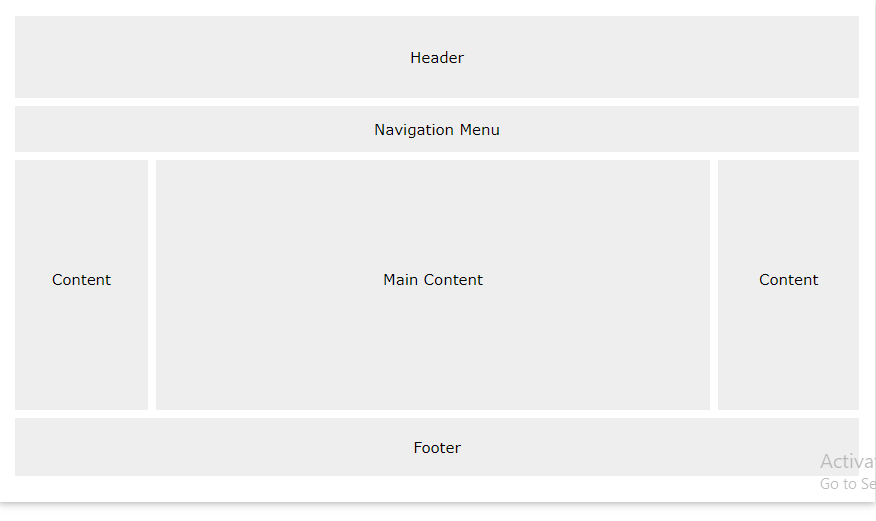
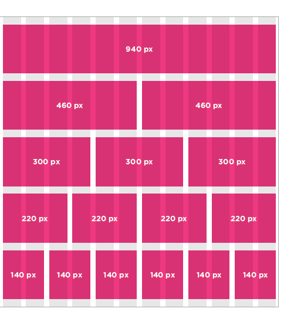
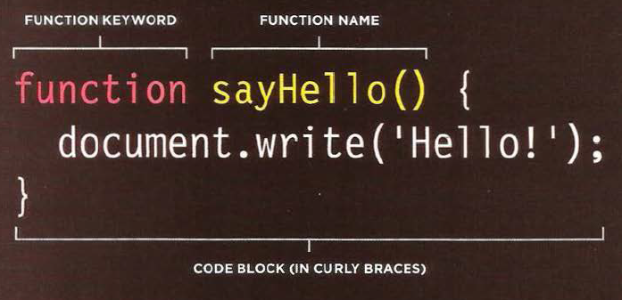
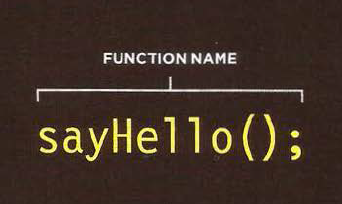
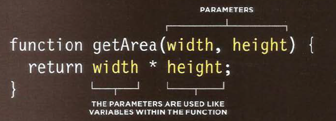

# Layout




To indicate where a box should be positioned, you may also need to use box offset properties to tell the browser how far from the top or bottom and left or right it should be placed. (You will meet these when we introduce the positioning schemes on the following pages.


---


## position:static
normal flow, each block-level element sits on top of the next one.
```
body {
width: 750px;
font-family: Arial, Verdana, sans-serif;
color: #665544;}
h1 {
background-color: #efefef;
padding: 10px;}
p {
width: 450px;}
```

## position:relative
Relative positioning moves an element in relation to where it would have been in normal flow.
```
p.example {
position: relative;
top: 10px;
left: 100px;}
```
## position:absolute
When the position property is given a value of absolute, the box is taken out of normal flow and no longer affects the position of other elements on the page.
``
h1 {
position: absolute;
top: 0px;
left: 500px;
width: 250px;}
p {
width: 450px;} 
``

## position:fixed

Fixed positioning is a type of absolute positioning that requires the position property to have a value of fixed.

```
h1 {
position: fixed;
top: 0px;
left: 50px;
padding: 10px;
margin: 0px;
width: 100%;
background-color: #efefef;}
p.example {
margin-top: 100px;}
```

## z-index

When you use relative, fixed, or absolute positioning, boxes can overlap.

```
h1 {
position: fixed;
top: 0px;
left: 0px;
margin: 0px;
padding: 10px;
width: 100%;
background-color: #efefef;
z-index: 10;}
p {
position: relative;
top: 70px;
left: 70px;}
```

## float
The float property allows you to take an element in normal flow and place it as far to the left or right of the containing element as possible.


## clear

```
body {
width: 750px;
font-family: Arial, Verdana, sans-serif;
color: #665544;}
p {
width: 230px;
float: left;
margin: 5px;
padding: 5px;
background-color: #efefef;}
.clear {
clear: left;}
```

---


## A Fixed Width Layout

```
body {
width: 960px;
margin: 0 auto;}
#content {
overflow: auto;
height: 100%;}
#nav, #feature, #footer {
background-color: #efefef;
padding: 10px;
margin: 10px;}
.column1, .column2, .column3 {
background-color: #efefef;
width: 300px;
float: left;
margin: 10px;}
li {
display: inline;
padding: 5px;}
```

## A Liquid Layout

```
body {
width: 90%;
margin: 0 auto;}
#content {overflow: auto;}
#nav, #feature, #footer {
margin: 1%;}
.column1, .column2, .column3 {
width: 31.3%;
float: left;
margin: 1%;}
.column3 {margin-right: 0%;}
li {
display: inline;
padding: 0.5em;}
#nav, #footer {
background-color: #efefef;
padding: 0.5em 0;}
#feature, .article {
height: 10em;
margin-bottom: 1em;
background-color: #efefef;}
```

## Possible Layouts:
960 Pixel wide 12 Column Grid



---

# WHAT IS A FUNCTION?

Functions let you group a series of statements together to perform a specific task. If different parts of a script repeat the same task, you can reuse the function (rather than repeating the same set of st atements).

```
var msg = 'Sign up to receive our newsletter for 10% off!';
function updateMessage() {
var el = document.getElementByld('message'};
el .textContent = msg;
}
updateMessage(};
```



and to call the function we write :


---



This function will calculated and return the area of a rectangle .

he git the width and height as a parameter , and multiplying the width and height and return area .

example 
```
getArea(2,2);

output:
4

```

we can assignment a function to varibale 
like this :

`var wallOne= calculateArea(5,2);`

---

# 6 Reasons for Pair Programming


1. `Greater efficiency` 
 it is easier to catch mistakes in the making. Research indicates that pair programing takes slightly longer, but produces higher-quality code that doesn’t require later effort in troubleshooting and debugging (let alone exposing users to a broken product).

2. `Engaged collaboration`
get off track when someone else is relying on you to complete the work

3. `Learning from fellow students`
developer has a unique approach to a specific problem, pair programming exposes the other developer to a new solution.

4. `Social skills`
Pair programming is great for improving social skills. When working with someone who has a different coding style, communication is key. 

5. `Job interview readiness`
A common step in many interview processes involves pair programming between a current employee and an applicant, either in person or through a shared screen.

6. `Work environment readiness`
Many companies that utilize pair programing expect to train fresh hires from CS-degree programs on how they operate to actually deliver a product.