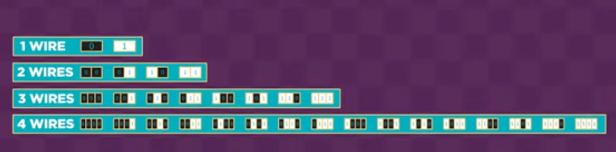
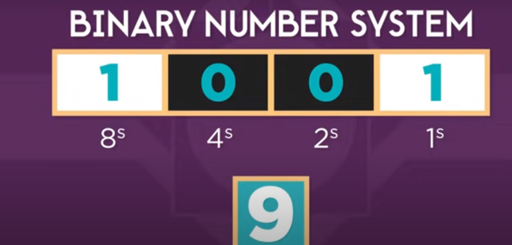
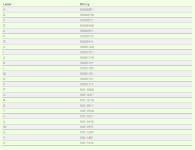
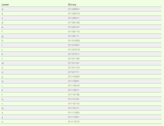

#  How Computers Work ?

Life now depends entirely on computers. Technology is about computers. It helps us to accomplish our tasks, to do our work, to collect information and calculate accuracy, and also to entertain.

---

### what makes a combuter a coumputer ? 
is take an Inbut , then store this input , then do a processing for this input , then the input become a output .

---

### How Computers Work: Binary & Data? 

the computer is worke on ones and zeros, and its play a big role in how the computer work from inside .

inside the computer there was many of electronic  wires and circuits that carry the information  in a computer.
 
all single wire is have a binary of data like ( 0 ore 1 ) 

ok , what about 2 wires ?

2 wires {0,0}{0,1}, {1,0},{1,1} .

lock of that :

any number can represented by 0 & 1 
for example:

not just a number , we can represent the string in binary :

#### and the images  is represent by millions of pixels per image , and videos  by +3 billion of pixel per minute , and sounds a  series of vibrations.

---

## How Computers Work: Circuits and Logic ?

a computer uses a millions of teeny electronic  components .

---

## How Computers Work: CPU, Memory, Input & Output ?

`cpu` : is the electronic circuitry that executes instructions comprising a computer program.

`memory`: s just like a human brain. It is used to store data and instructions. Computer memory is the storage space in the computer, where data is to be processed and instructions required for processing are stored.

`input` :refers to any information, or data, that is sent to a computer for processing. Input is often sent to the computer from a device such as a keyboard, mouse, or other input device.

`output`: Data generated by a computer is referred to as output. This includes data produced at a software level, such as the result of a calculation, or at a physical level, such as a printed document. 

---

## How Computers Work: Hardware and Software ?
In general, the computer consists of software and hardware, and in order for them to have a benefit, they must be interconnected with each other, for example: when you want to play a specific game, there must be a controller or a keyboard to enable interaction with this game.

#### Also, there are two types of outputs:
1.  `Electronic outputs`: such as photos, videos, audio, files ... etc.
2.  `Physical output`: for example, a 3D printer
