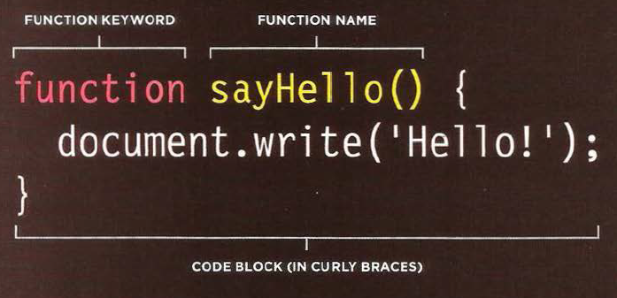
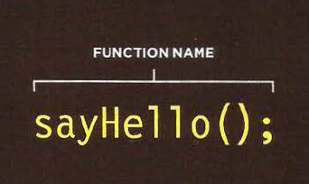

# What is JavaScript ?

###  JavaScript allows you to make web pages more interactiv by accessing and modifying the content and marckup used in a web page while it is begin viewed in the browser 


### React to event , its like when a button is pressed pr a lin is clicked ....etc.


`Access the content of the page`

`Modify the content of the page`

`Program rules or instructions the browser can follow`

`React to events triggered by the user or browser`

---


## A `script` is a series of instructions that a computer can follow to achieve a goal.

To approach writing a script, break down your goal into a series of tasks and then work out each step needed to complete that task (a flowchart can help).


---


# OPERATORS

EXPRESSIONS THAT JUST *** ASSIGN A VALUE TO A VARIABLE ***

`var color = 'beige';`

EXPRESSIONS THAT USE *** TWO OR MORE VALUES TO RETURN A SINGLE VALUE ***

`var area = 3 * 2;`

1. ASSIGNMENT OPERATORS
`color = 'beige';`

2. COMPARISON OPERATORS
`buy = 3 > 5;`

3. ARITHMETIC OPERATORS
`area = 3 * 2;`

4. LOGICAL OPERATORS
`buy= (5 > 3) && (2 < 4);`

5. STRING OPERATORS
`greeting= 'Hi 1 + 'Mol ly';`


---


# WHAT IS A FUNCTION?

#### Functions let you group a series of statements together to perform a specific task. If different parts of a script repeat the same task, you can reuse the function (rather than repeating the same set of st atements).

```
var msg = 'Sign up to receive our newsletter for 10% off!';
function updateMessage() {
var el = document.getElementByld('message'};
el .textContent = msg;
}
updateMessage(};
```



and to call the function we write :


---


This function will calculated and return the area of a rectangle .

he git the width and height as a parameter , and multiplying the width and height and return area .

example 
```
getArea(2,2);

output:
4

```

we can assignment a function to varibale 
like this :

`var wallOne= calculateArea(5,2);`

