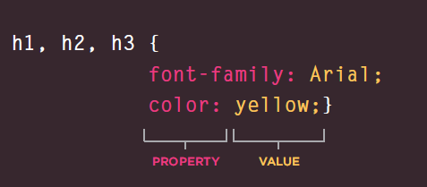
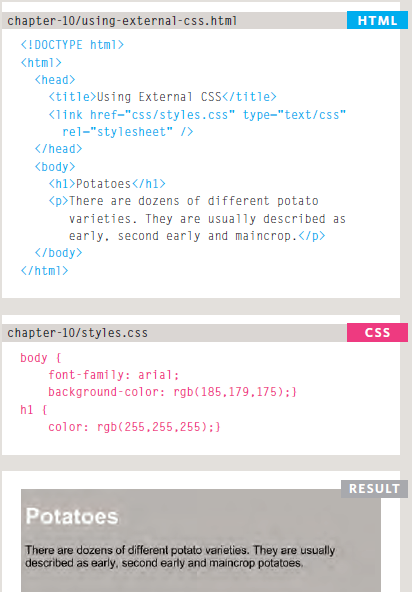
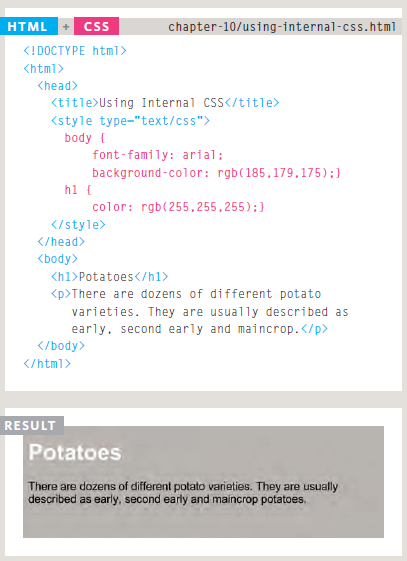
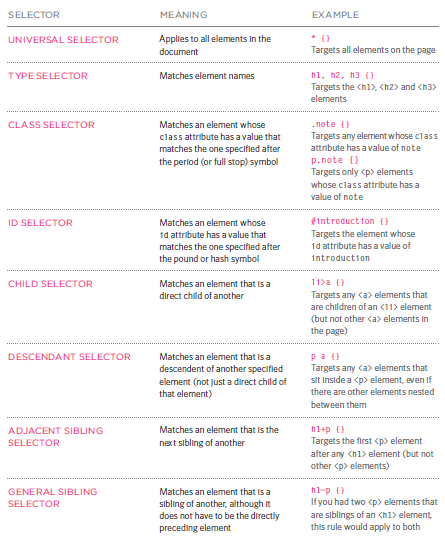

# Introducing CSS

### CSS allows you to create rules that control the way that each individual box (and the contents of that box) is presented.

CSS works by associating rules with HTML elements. These rules govern how the content of specified elements should be displayed. A CSS rule contains two parts: a `selector` and a `declaration`.


```
p {
  font-family:arial;
}

```

`p`: *selector*   `font-family:arial` : *declaration* 

> This rule indicates that all `<p>`
elements should be shown in the
Arial typeface.
>>`Selectors` indicate which
element the rule applies to.
The same rule can apply to
more than one element if you
separate the element names
with commas.
>>>`Declarations` indicate how
the elements referred to in
the selector should be styled.
Declarations are split into two
parts (a property and a value),
and are separated by a colon.




>This rule indicates that all `<h1>`, `<h2>` and `<h3>` elements should be shown in the Arial typeface, in a yellow color.
>>`Properties` indicate the aspects of the element you want to change. For example, color, font, width, height and border.
>>>`Values` specify the settings you want to use for the chosen properties. For example, if you want to specify a color property
then the value is the color you want the text in these elements to be.


## Using External CSS




## Using Internal CSS




## CSS Selectors




---

# `Color` :


#### The color property allows you to specify the color of text inside an element. You can specify any color in CSS in one of three ways:

1. `rgb values` : These express colors in terms of how much red, green and blue are used to make it up. For example: rgb(100,100,90)
2. `hex codes` : These are six-digit codes that represent the amount of red, green and blue in a color, preceded by a pound or hash # sign. For example: #ee3e80
3. `color names`: There are 147 predefined color names that are recognized by browsers. For example: DarkCyan


---


### background-color 

```
body {
background-color: rgb(200,200,200);}
h1 {
background-color: DarkCyan;}
h2 {
background-color: #ee3e80;}
p {
background-color: white;}

```


` ``Every color on a computer screen is created by mixing amounts of red, green, and blue. To find the color you want, you can use color picker.`` `


## Hue , Saturation , Brightness:

1. `Hue` : Hue is near to the colloquial idea of color. Technically speaking however, a color can also have saturation and brightness as well as hue.

2. `Saturation` : Saturation refers to the amount of gray in a color. At maximum saturation, there would be no gray in the color. At minimum saturation, the color would be mostly gray.
3. `Brightness` :Brightness (or "value") refers to how much black is in a color. At maximum brightness, there would be no black in the color. At minimum brightness, the color would be very dark.

---
## Contrast

When picking foreground and background colors, it is important to ensure that there is enough contrast for the text to be legible.


---
## Opacity

CSS3 introduces the opacity property which allows you to specify the opacity of an element and any of its child elements. The value is a number between 0.0 and 1.0 (so a value of 0.5 is 50% opacity and 0.15 is 15% opacity).

```
p.one {
background-color: rgb(0,0,0);
opacity: 0.5;}
p.two {
background-color: rgb(0,0,0);
background-color: rgba(0,0,0,0.5);}

```


---
## HSL Colors

## `hsl, hsla`

`hue`
This is expressed as an angle (between 0 and 360 degrees).

`saturation`
This is expressed as a percentage. 

`lightness` 
This is expressed as a percentage with 0% being white, 50% being normal, and 100% being black. The hsla color property allows you to specify color properties using hue, saturation, and lightness as above, and adds a fourth value which represents transparency (just like the rgba property)  The a stands for:

`alpha`
This is expressed as a number between 0 and 1.0. For example, 0.5 represents50% transparency, and 0.75 represents 75% transparency.